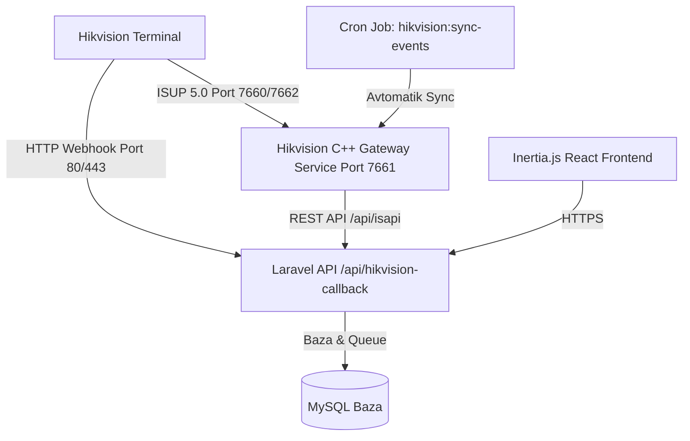

# PayDay Boshqaruv Paneli — Hujjatlar To‘plami (Docs)

Ushbu papka **PayDay** tizimini yangi serverga o‘rnatish, sozlash, xavfsizlik va **Hikvision yuz/karta terminallari** bilan to‘liq integratsiya qilish bo‘yicha batafsil qo‘llanmalarni o‘z ichiga oladi.

---

## 📚 Hujjatlar Mundarijasi

| Hujjat | Tavsif |
|---|---|
| [1. Serverni O‘rnatish va Sozlash](server-installation-guide.md) | Ubuntu/Debian serverga PHP 8.2+, Nginx, MySQL, Node.js, SSL, Supervisor va Cron o‘rnatish |
| [2. Hikvision Terminallari Integratsiyasi](hikvision-integration-guide.md) | Hikvision qurilmalarini ISUP 5.0 va HTTP Listening orqali ulash, tarmoq sozlamalari va yuz rasmlari talablari |
| [3. Hikvision ISUP Gateway Servisi](hikvision-gateway-service.md) | C++ ISUP Gateway daemonini kompilyatsiya qilish, systemd orqali xizmat sifatida ishga tushirish va monitoring |
| [4. Muammolarni Bartaraf Etish (FAQ)](troubleshooting-and-faq.md) | Offline holatlar, yuz yuklanmaslik, portlar, vaqt (Timezone) va xatoliklarni bartaraf etish |

---

## ⚡ Tezkor Ma'lumot (Arxitektura)

- **Asosiy Texnologiyalar:** PHP 8.2+, Laravel 12, Inertia.js, React 19, Tailwind CSS, TypeScript, C++ ISUP Gateway.
- **Tavsiya etilgan OS:** Ubuntu 22.04 / 24.04 LTS x86_64.
- **Standart Vaqt Mintaqasi:** `Asia/Tashkent` (+05:00).
