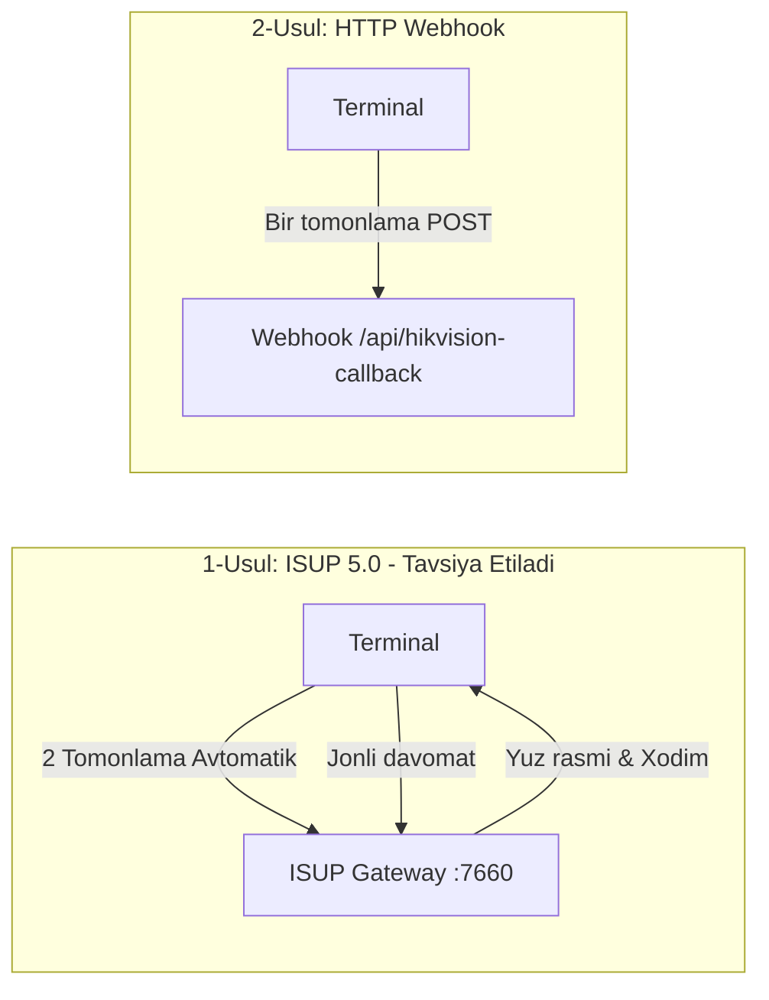

# 2. Hikvision Yuz va Karta Terminallari Integratsiyasi Qo‘llanmasi

Ushbu qo‘llanmada Hikvision Face Terminal (DS-K1T341, DS-K1T671, DS-K1T343, DS-K1T804 va boshqa Face/Card seriyalari) qurilmalarini **PayDay** tizimiga ulashning barcha usullari, tarmoq talablari va xodimlar sinxronizatsiyasi keltirilgan.

---

## 1. Qo‘llab-quvvatlanadigan Hikvision Qurilmalari
- **Face Recognition Terminals:** DS-K1T341, DS-K1T342, DS-K1T343, DS-K1T671, DS-K1T672, DS-K1T606, DS-K1T607 seriyalari.
- **Card & Fingerprint Terminals:** DS-K1T804, DS-K1T805, DS-K1T501 seriyalari.
- **Dasturiy ta'minot (Firmware):** ISUP 5.0 (EHome 5.0) yoki HTTP Listening-ni qo‘llab-quvvatlovchi rasmiy dasturiy ta'minot.

---

## 2. Ulash Usullari

PayDay tizimi Hikvision qurilmalari bilan 2 xil rejimda ishlay oladi:



---

## 3. 1-Usul: ISUP 5.0 (EHome 5.0) Integratsiyasi (Tavsiya etiladi)

### 3.1. Nima uchun ISUP 5.0?
1. **Statik IP talab qilinmaydi:** Terminal filialda oddiy Wi-Fi, 4G router yoki DHCP orqali ishlayveradi.
2. **2 tomonlama to‘liq boshqaruv:**
   - Panelda xodim yaratilganda yuz rasmi va ma'lumotlari avtomatik terminalga yuklanadi.
   - Terminalda xodim o‘chirilganda yoki tahrirlanganda avtomatik sinxronlanadi.
   - Jonli davomat (Check-in/Check-out) millisekundlarda serverga keladi.
   - Internet uzilib qolganda terminal xotirasida saqlanadi va internet paydo bo‘lganda server avtomatik tortib oladi (`hikvision:sync-events`).

### 3.2. Hikvision Terminal Web Interfeysida Sozlash
1. Kompyuteringiz orqali terminalning IP manziliga brauzerda kiring (masalan: `http://192.168.1.64`).
2. Quyidagi menyuga o‘ting:
   ```
   Configuration ➔ Network ➔ Advanced ➔ Device Access / Platform Access ➔ ISUP (yoki EHome)
   ```
3. Parametrlarni to‘ldiring:
   - **Enable (Faollashtirish):** `ON` (Belgilang)
   - **Protocol Version:** `ISUP 5.0` (yoki EHome 5.0)
   - **Server Address Type:** `IP Address`
   - **Server IP:** Serveringizning ochiq Statik Public IP manzili (Masalan: `193.180.213.188`)
   - **Server Port:** `7660`
   - **Device ID:** PayDay panelida filiallaringiz uchun kiritgan unikal qurilma ID (Masalan: `TERM_BALAM_01`)
   - **Device Key (Encryption Key / Register Password):** PayDay panelida qurilma qo‘shishda kiritilgan kalit (Masalan: `Hik12345678`)
4. **Save (Saqlash)** tugmasini bosing.
5. 10-30 soniya ichida **Status** qatorida `Online` (Yashil) yozuvi chiqishi kerak.

---

## 4. 2-Usul: HTTP Listening / Webhook Rejimi (Klassik)

Agar sizning terminalingizda ISUP bo‘lmasa yoki faqat oddiy event webhook kerak bo‘lsa:

### 4.1. Sozlash Bosqichlari:
1. Hikvision Web menyusiga o‘ting:
   ```
   Configuration ➔ Network ➔ Advanced ➔ HTTP Listening (yoki Alarm Center)
   ```
2. Parametrlarni to‘ldiring:
   - **Enable:** `ON`
   - **Destination IP / Domain:** `panel.payday.uz` (yoki server IP)
   - **Port:** `80` (HTTP) yoki `443` (HTTPS)
   - **URL Path:** `/api/hikvision-callback`
   - **Protocol:** `HTTP` yoki `HTTPS`
3. **Save** tugmasini bosing.
4. Har safar xodim yuzini yoki kartasini skaner qilganda terminal to‘g‘ridan-to‘g‘ri `POST /api/hikvision-callback` manziliga JSON/Multipart hodisa ma'lumotini yuboradi.

---

## 5. Xodimlar va Yuz Rasmlari Talablari

Terminallar yuzni aniq tanishi va xatoliksiz yuklanishi uchun quyidagi standartlarga rioya qilinishi shart:

| Parametr | Standart Talab |
|---|---|
| **Fayl Formati** | Faqat `JPG` / `JPEG` (PNG yoki WebP qo‘llab-quvvatlanmaydi) |
| **Fayl Hajmi** | 20 KB dan 200 KB gacha (Tavsiya: ~80 KB) |
| **Rasm O‘lchami (Piksel)** | Kamida `480x640` px, maksimal `1080x1920` px |
| **Yuzning Holati** | To‘g‘riga qaragan, ko‘zlar ochiq, ko‘zoynaksiz yoki oddiy shaffof ko‘zoynakda, yaxshi yoritilgan fonda |
| **Xodim Raqami (Employee No)** | Faqat raqamlar yoki lotin harflari (Masalan: `1001`, `W_005`). Bo‘sh joy yoki maxsus belgilar ishlatilmasin |

---

## 6. Terminal Tarmoq va Vaqt (NTP) Sozlamalari

### 6.1. Vaqt Mintaqasi (Time Zone)
Davomat vaqti aniq bo‘lishi uchun terminal vaqti server bilan bir xil bo‘lishi shart:
- **Vaqt mintaqasi:** `GMT+05:00 (Tashkent, Islamabad, Karachi)`
- **NTP Server:** `pool.ntp.org` yoki `time.google.com`
- **NTP Port:** `123`
- **Interval:** 60 daqiqa

### 6.2. DNS Serverlar
Agar terminal domen nomi orqali ulansa:
- **Preferred DNS:** `8.8.8.8` (Google)
- **Alternate DNS:** `1.1.1.1` (Cloudflare)
